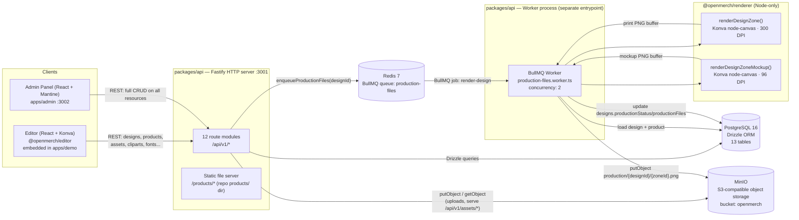
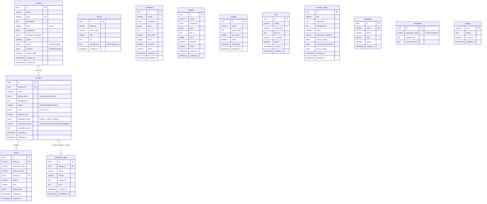
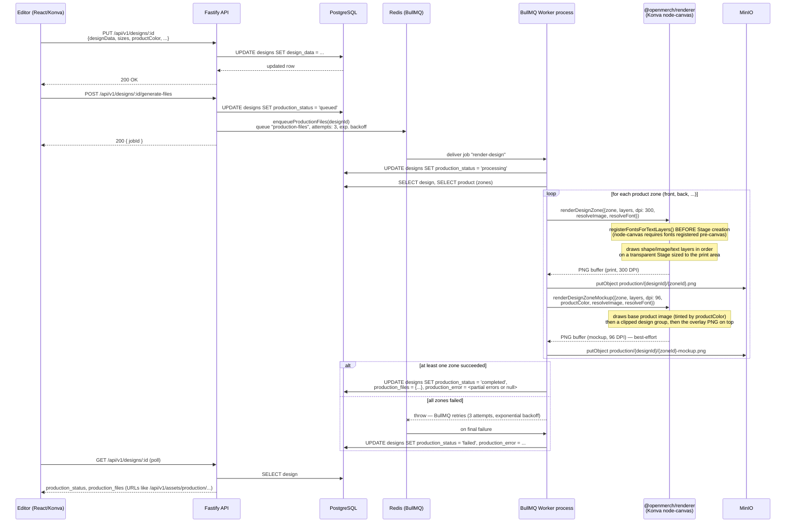
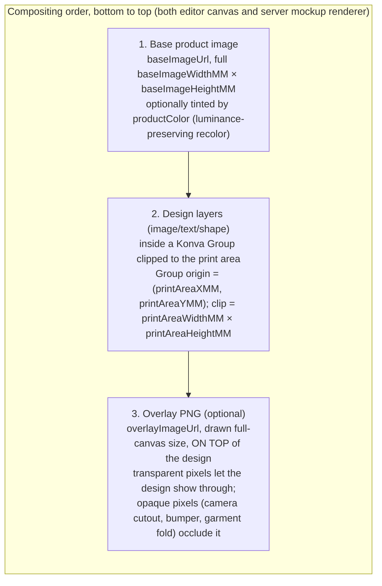

# Architecture

Este documento describe la arquitectura real y actual de OpenMerch Engine tal como está implementada en este repositorio. Está generado a partir del código fuente (`packages/api`, `packages/renderer`, `packages/editor`, `apps/admin`), no de la intención de diseño — donde el código no responde una pregunta, eso se indica explícitamente en vez de suponerlo.

## 1. Qué es OpenMerch Engine

OpenMerch Engine es una plataforma de personalización de productos self-hosted y open-source para ecommerce: un editor de "diseña tu propio merch" más el backend necesario para convertir el diseño de un cliente en un archivo listo para imprimir. Un comprador (o un merchant, desde el panel de admin) elige un producto — playera, taza, funda de celular, póster, cojín, etc. — y coloca imágenes, texto y formas sobre una o más zonas de impresión usando un editor de canvas basado en el navegador. El diseño se guarda como JSON estructurado (capas, posiciones en milímetros, fuentes, efectos), no como una imagen plana, así que se mantiene editable e independiente de la resolución.

Convertir un diseño guardado en archivos entregables es un job asíncrono: la API encola un job de BullMQ, un proceso worker separado renderiza el diseño a resolución de impresión (300 DPI) usando Konva del lado del servidor (`node-canvas`) más un mockup de menor resolución orientado al merchant (96 DPI) con la foto del producto compuesta debajo y cualquier overlay del producto (recorte de cámara, bordes de bumper, etc.) compuesto encima. Los archivos de salida terminan en MinIO (almacenamiento de objetos compatible con S3) y la fila del diseño en Postgres se actualiza con sus URLs.

El sistema es un monorepo pnpm/Turborepo dividido en cuatro tipos de paquetes: `@openmerch/core` (tipos TypeScript compartidos, conversión de unidades), `@openmerch/renderer` (renderizado del lado del servidor, solo Node), `@openmerch/editor` (el componente de canvas React/Konva, embebible en cualquier app host), y dos apps — `apps/demo` (un ejemplo mínimo de integración) y `apps/admin` (el back office orientado al merchant para gestionar productos, diseños, órdenes, cliparts, fuentes, templates y configuración). `packages/api` es la API HTTP con Fastify y el entrypoint del worker de BullMQ, y comparten un mismo esquema de Postgres (Drizzle ORM) y un mismo bucket de MinIO. `packages/embroidery` y `plugins/plugin-woocommerce` existen como directorios placeholder vacíos (solo `.gitkeep`) — no están implementados.

## 2. Arquitectura del sistema



Notas sobre lo que el código realmente hace, no lo que una configuración típica podría sugerir:

- El servidor de la API y el worker son **dos procesos de Node separados** que se inician de forma independiente (`pnpm --filter @openmerch/api dev` / `pnpm --filter @openmerch/api worker`, o `node dist/index.js` / `node dist/worker.js` en Docker). Comparten el mismo esquema de Postgres, el mismo bucket de MinIO y el mismo nombre de queue de BullMQ (`production-files`) sobre Redis, pero no se llaman entre sí directamente — `packages/api/src/worker.ts` es un entrypoint standalone, no un subproceso del servidor HTTP.
- El paquete del editor no es una app standalone — `apps/demo` es el host de ejemplo que renderiza `<ProductEditor product={...} />`. No existe un "servidor de editor" separado; el editor habla con la misma API de Fastify que todo lo demás vía `packages/editor/src/services/api.ts`.
- Sharp es una dependencia de `packages/api`, pero solo se usa dentro de `ImageResolver.rasterizeSvg()` (`packages/api/src/jobs/resolvers/image-resolver.ts`) para rasterizar capas de clipart/shape en SVG a PNG antes de pasarlas a Konva. La generación real de PNG a 300 DPI / 96 DPI la hace el build para Node de Konva (`konva/lib/index-node.js`), respaldado por `node-canvas` (Cairo/Pango), no por Sharp.
- `docker-compose.yml` levanta Postgres/Redis/MinIO por default; los servicios `api` y `worker` son opt-in vía los perfiles de Compose `app` y `worker` — el flujo de desarrollo documentado es `pnpm dev` / `pnpm worker` nativos contra la infra dockerizada.
- No hay una capa de autenticación/autorización visible en `packages/api/src` — las rutas son endpoints REST sin autenticar. CORS se configura vía `CORS_ORIGIN` (por default `*`).

## 3. Esquema de base de datos (PostgreSQL, Drizzle ORM)

Fuente: `packages/api/src/db/schema.ts`, migraciones en `packages/api/drizzle/` (3 migraciones al momento de escribir esto: `0000_bitter_rocket_racer`, `0001_wandering_sue_storm`, `0002_graceful_iceman`). Todas las tablas usan llaves primarias `uuid` con `defaultRandom()` excepto `settings` (llave primaria string) y `translations`/`languages` (uuid).



Puntos que son fáciles de asumir mal si se adivinan en vez de leer el código:

- **`production_jobs` está definida en el esquema y tiene su propia migración, pero ninguna ruta ni código de worker la lee o escribe** (`Grep` de `productionJobs` solo da match en `schema.ts`). El estado de producción y las URLs de salida en realidad se rastrean directamente en `designs.productionStatus`, `designs.productionFiles` (un mapa JSON `{ [zoneId]: { print, mockup } }`) y `designs.productionError`. Considera `production_jobs` como vestigial/sin uso a menos que un cambio futuro empiece a usarla.
- **`translations.languageCode` no tiene un constraint de foreign key** hacia `languages.code` en el esquema — la relación se aplica solo a nivel de aplicación en `routes/languages.ts`.
- `products`, `templates`, `cliparts`, `fonts`, `shapes`, `printing_types` son tablas de catálogo independientes; ninguna referencia a las demás ni a `designs` a nivel de base de datos. Un diseño referencia su producto vía `designs.product_id`, pero qué cliparts/fuentes/shapes se usaron en un diseño no se rastrea de forma relacional — esa información solo existe dentro de `designs.design_data` (el JSON de capas), por ejemplo `TextLayer.fontId`.
- Tablas independientes que no se muestran con relaciones porque no tienen ninguna: `assets` (registro genérico de uploads, indexado por `storage_key` de MinIO), `settings` (almacén plano clave/valor para configuración editable desde admin, como branding y API keys, con un flag `is_secret`).

## 4. Pipeline de producción (guardado de diseño → PNGs de impresión + mockup)



Detalles de implementación clave que vale la pena señalar porque no son obvios en una descripción genérica de "job queue":

- **Dos renders por zona, con modos de falla independientes.** `renderDesignZone` (impresión, 300 DPI, fondo transparente) es la salida contractual — si falla, toda la zona se marca como fallida. `renderDesignZoneMockup` (96 DPI, foto de producto + diseño + overlay) es best-effort: una falla del mockup se registra pero no hace fallar la zona, ya que el archivo de impresión sigue siendo utilizable sin él.
- **El éxito parcial es un estado terminal válido.** Si la zona "front" se renderiza pero "back" lanza un error, el diseño de todas formas termina en `production_status: 'completed'`, con `production_files` conteniendo solo "front" y `production_error` con una lista de errores por zona unida por punto y coma. Solo una falla **total** en todas las zonas lanza un error (disparando el retry/backoff de BullMQ) y eventualmente deja `production_status: 'failed'`.
- **Resolución de zona consciente de variantes.** Si el `canvasWidthMM`/`canvasHeightMM` guardado de un diseño no coincide con las dimensiones de zona por default del producto (diseño hecho contra una variante de talla/dispositivo), el worker busca en `product.variants[].zones` una zona que coincida y sustituye sus dimensiones/imágenes antes de renderizar.
- **La resolución de imágenes está abstraída detrás de `ImageResolver`** (`packages/api/src/jobs/resolvers/image-resolver.ts`), que maneja cuatro formas de `src`: URLs `data:`, `/api/v1/assets/...` (MinIO), `http(s)://...` (externas, p. ej. imágenes generadas por IA o de stock), y `/products/...` (imágenes de mockup incluidas en el repo, leídas directo de disco en dev o vía fallback HTTP en Docker). Los buffers SVG se detectan automáticamente y se rasterizan con Sharp antes de pasarse a Konva.
- **Las fuentes deben registrarse antes de crear el Stage de Konva**, no de forma perezosa — esto es un requisito de `node-canvas`, así que ambas funciones de render llaman a `registerFontsForTextLayers()` por adelantado vía `FontResolver` (`packages/api/src/jobs/resolvers/font-resolver.ts`), resolviendo ya sea por nombre de `fontFamily` o por `fontId` (UUID) cuando el diseño usó una fuente personalizada subida por el merchant.
- Las URLs de salida son rutas internas de la API (`/api/v1/assets/production/{designId}/{zoneId}.png`), servidas de vuelta a través de `GET /api/v1/assets/*` en `routes/assets.ts`, que transmite el objeto desde MinIO — los clientes nunca hablan directamente con MinIO.

## 5. Zonas de impresión y overlays (sistema de máscaras)

No existe una abstracción de "máscara" dedicada en el código — el efecto se logra con tres primitivas que cooperan entre sí, todas gobernadas por `ProductZone` (`packages/core/src/types/product.ts`):

```ts
interface ProductZone {
  id: string;
  name: string;
  baseImageWidthMM: number;
  baseImageHeightMM: number;
  printAreaWidthMM: number;
  printAreaHeightMM: number;
  printAreaXMM: number;
  printAreaYMM: number;
  baseImageUrl: string;
  overlayImageUrl?: string; // optional, on top of design layers
}
```



Qué hace cada pieza, según el código real:

1. **Clip del área de impresión (la "máscara").** Tanto `ProductEditor.tsx` (editor, canvas en vivo) como `render-zone-mockup.ts` (mockup del servidor) envuelven las capas del diseño en un `Group` de Konva posicionado en `(printAreaXMM, printAreaYMM) * pxPerMM` con `clipX/clipY = 0` y `clipWidth/clipHeight = printAreaWidthMM/HeightMM * pxPerMM`. Es un clip rectangular estricto — no hay una máscara de forma arbitraria/vectorial en el código base, solo clipping de rectángulo alineado a los ejes vía las propiedades `clip` de Konva. `renderDesignZone` (el archivo de impresión puro, sin foto de producto) no necesita este clip porque su canvas *es* el área de impresión (`widthPx = printAreaWidthMM @ dpi`), así que dibuja las capas directamente sin un grupo con offset.
2. **Imagen de overlay del producto.** `overlayImageUrl` es opcional por zona. Cuando está presente, se dibuja como una imagen de canvas completo **después** de las capas de diseño, tanto en el `CanvasView` en vivo del editor como en `renderDesignZoneMockup` del servidor. No se usa en `renderDesignZone` (el archivo de impresión puro) — la salida de impresión nunca necesita los bordes decorativos de la foto del producto, solo el arte del diseño. En concreto, así es como el anillo de recorte de cámara de una funda de celular o el asa de una taza pueden verse "delante" del diseño del cliente sin que el archivo de impresión mismo contenga ese arte.
3. **Tinte de color del producto.** `useColoredProduct` (hook del editor, `packages/editor/src/hooks/useColoredProduct.ts`) y `tintImage()` (servidor, inline en `render-zone-mockup.ts`) implementan de forma independiente el *mismo* algoritmo de recoloreado que preserva la luminancia — muestrean las cuatro esquinas para detectar un fondo oscuro o claro, detectan transparencia alfa, y luego remapean la luminancia de cada píxel visible al color hex objetivo mientras se saltan los píxeles de fondo (casi blancos en fondos claros, casi negros en fondos oscuros). Esto mantiene el mockup renderizado en admin visualmente consistente con lo que el cliente vio en el editor cuando eligió un color de prenda. Es una implementación duplicada, no una función compartida desde `@openmerch/renderer` o `@openmerch/core` — si el algoritmo cambia, hay que actualizar ambas copias.
4. **Zonas específicas por variante.** Un `ProductVariant` puede traer sus propias `zones: ProductZone[]`, reemplazando por completo las zonas por default del producto (distinto `baseImageUrl`, distinta área de impresión). `ZoneSelector.tsx` en el editor solo cambia entre las zonas de *nivel superior* de un producto (p. ej. front/back) por `activeZoneId`; la selección de variante y su efecto sobre la geometría de zona se maneja en otro lugar del store del editor / `ProductTab.tsx` (no se rastreó en detalle aquí — se marca que la ruta de UI de swap variante-a-zona no fue verificada por completo contra este documento, solo su consumo por parte del worker en la sección 4).

## 6. Estructura del monorepo

Verificado con `Glob`/`find` contra el árbol de trabajo (excluyendo `node_modules`, `dist`, `.turbo`, `.git`, `.claude`, y las carpetas grandes de assets binarios `products/`, `overlays-products-base/`, `apps/demo/public/products/`):

```
openmerch-engine/
├── apps/
│   ├── admin/                        # Merchant back office — React 19 + Mantine 9, port 3002
│   │   └── src/
│   │       ├── components/           # Layout, LinksGroup, ZoneEditor
│   │       ├── hooks/                # useConfirm
│   │       ├── i18n/
│   │       ├── pages/                # Dashboard, Products, ProductEdit, Designs, Templates,
│   │       │                         # Cliparts, Shapes, Fonts, PrintingTypes, Orders,
│   │       │                         # Languages, SettingsPage, ComingSoon
│   │       └── services/api.ts
│   └── demo/                         # Minimal integration example — React 19, port 3000
│       └── src/
│           ├── App.tsx
│           ├── products/tshirt.ts    # example ProductZone config
│           └── main.tsx
├── docs/
│   ├── PROJECT_CONTEXT.md
│   ├── ROADMAP.md
│   └── ARCHITECTURE.md               # this file
├── packages/
│   ├── core/                         # Shared types + unit conversion (mmToPx etc.), no deps
│   │   └── src/{types,utils}/
│   ├── renderer/                     # Server-side rendering (Node-only, Konva node-canvas)
│   │   └── src/
│   │       ├── layers/               # image.ts, shape.ts, text.ts, text-effects.ts
│   │       ├── konva-node.ts         # dynamic import of konva/lib/index-node.js
│   │       ├── render-zone.ts        # print PNG, 300 DPI
│   │       └── render-zone-mockup.ts # mockup PNG, 96 DPI, base+overlay compositing
│   ├── editor/                       # Embeddable React/Konva canvas editor
│   │   └── src/
│   │       ├── components/           # ProductEditor (root), DesignLayer, ZoneSelector,
│   │       │   ├── contextual/       #   NavBar, Toolbar, SnapGuides, StageNavigator...
│   │       │   └── sidebar/tabs/     # per-tool popovers (Fill, Filters, TextEffects...)
│   │       │                         # sidebar tabs: Cliparts, Image, Shapes, AiImage,
│   │       │                         # Backgrounds, Photos, Layers, Text, Product
│   │       ├── hooks/                # useImage, useTintedImage, useColoredProduct,
│   │       │                         # useKeyboardShortcuts
│   │       ├── store/editorStore.ts  # Zustand store
│   │       ├── services/api.ts
│   │       └── utils/                # exportDesign, textPaths
│   ├── api/                          # Fastify HTTP API + BullMQ worker entrypoint
│   │   └── src/
│   │       ├── routes/               # 12 modules: health, products, designs, assets,
│   │       │                         # templates, cliparts, shapes, fonts,
│   │       │                         # printing-types, orders, languages, settings
│   │       ├── jobs/
│   │       │   ├── queues.ts         # BullMQ Queue definition ("production-files")
│   │       │   ├── connection.ts     # Redis connection (parsed from REDIS_URL)
│   │       │   ├── resolvers/        # ImageResolver, FontResolver
│   │       │   └── workers/production-files.worker.ts
│   │       ├── db/                   # schema.ts (Drizzle), index.ts (client)
│   │       ├── storage/minio.ts
│   │       ├── index.ts              # HTTP server entrypoint
│   │       ├── worker.ts             # Worker process entrypoint (separate from index.ts)
│   │       └── seed.ts
│   │   ├── drizzle/                  # SQL migrations + snapshots (3 migrations)
│   │   └── seeds/                    # products/catalog.json, translations/{es,fr}.json
│   ├── embroidery/                   # placeholder — .gitkeep only, not implemented
│   └── (workspace root also defines packages/core, editor, renderer, api above)
├── plugins/
│   └── plugin-woocommerce/           # placeholder — .gitkeep only, not implemented
├── products/                         # Product mockup base images + overlays (served statically)
├── overlays-products-base/           # Source .psd files for overlays (design assets, not code)
├── docker-compose.yml                # postgres, redis, minio (default) + api, worker (profiles)
├── turbo.json / pnpm-workspace.yaml
└── package.json                      # workspace root, pnpm@9.15.4, Node >=20
```

## 7. Stack tecnológico (versiones tomadas de `package.json`, tal como está commiteado)

| Capa | Tecnología | Versión |
|---|---|---|
| Herramientas de monorepo | pnpm workspaces + Turborepo | pnpm `9.15.4`, turbo `^2.4.4` |
| Lenguaje | TypeScript | `^5.7.3` (todos los paquetes) |
| Runtime | Node.js | `>=20.0.0` (engines), base de Docker `node:20-bookworm-slim` |
| Servidor de API | Fastify | `^5.8.4` |
| Plugins de API | `@fastify/cors` `^11.2.0`, `@fastify/multipart` `^9.4.0`, `@fastify/static` `^9.0.0` | |
| ORM | Drizzle ORM + `drizzle-kit` | `^0.45.2` / `^0.31.10` |
| Driver de Postgres | `postgres` (postgres-js) | `^3.4.8` |
| Base de datos | PostgreSQL | `16-alpine` (docker-compose) |
| Queue | BullMQ | `^5.71.1` |
| Backend de queue | Redis | `7-alpine` (docker-compose) |
| Almacenamiento de objetos | MinIO (servidor) + cliente JS `minio` | servidor `minio/minio:latest`, cliente `^8.0.7` |
| Procesamiento de imágenes | Sharp (solo rasterización de SVG) | `^0.34.2` |
| Canvas del lado del servidor | `canvas` (node-canvas, backend Cairo/Pango) | `^3.1.0` |
| Motor de renderizado | Konva (build para Node, `index-node.js`) | `^9.3.16` (renderer) / `^9.3.18` (editor, admin) |
| UI del editor | React + ReactDOM | `^19.0.0` |
| Bindings de canvas del editor | `react-konva` | `^19.0.3` |
| Estado del editor | Zustand | `^5.0.3` |
| Íconos del editor | `lucide-react` | `^0.577.0` |
| Build del editor | Vite + `vite-plugin-dts` | `^6.1.0` / `^4.5.0` |
| Framework de UI de admin | Mantine (`core`, `dropzone`, `form`, `hooks`, `modals`, `notifications`) | `^9.0.0` |
| Routing de admin | `react-router-dom` | `^7.6.1` |
| Runtime de desarrollo (API) | `tsx` (watch mode) | `^4.21.0` |
| Linting | ESLint + `typescript-eslint` | `^9.18.0` / `^8.21.0` |
| Formateo | Prettier | `^3.4.2` |
| Testing | Vitest | `^3.0.4` (usado al menos en `packages/core`) |
| Licencia | MIT | — |

Puertos usados en desarrollo local (según configs de Vite y defaults de `config.ts`): API `3001`, app demo `3000`, app admin `3002`; defaults de infra Postgres `5432`, Redis `6379`, MinIO `9000` (API) / `9001` (consola).
