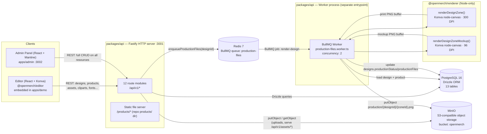
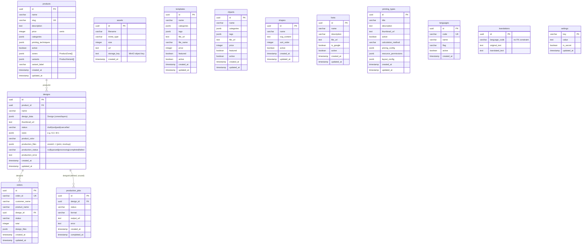
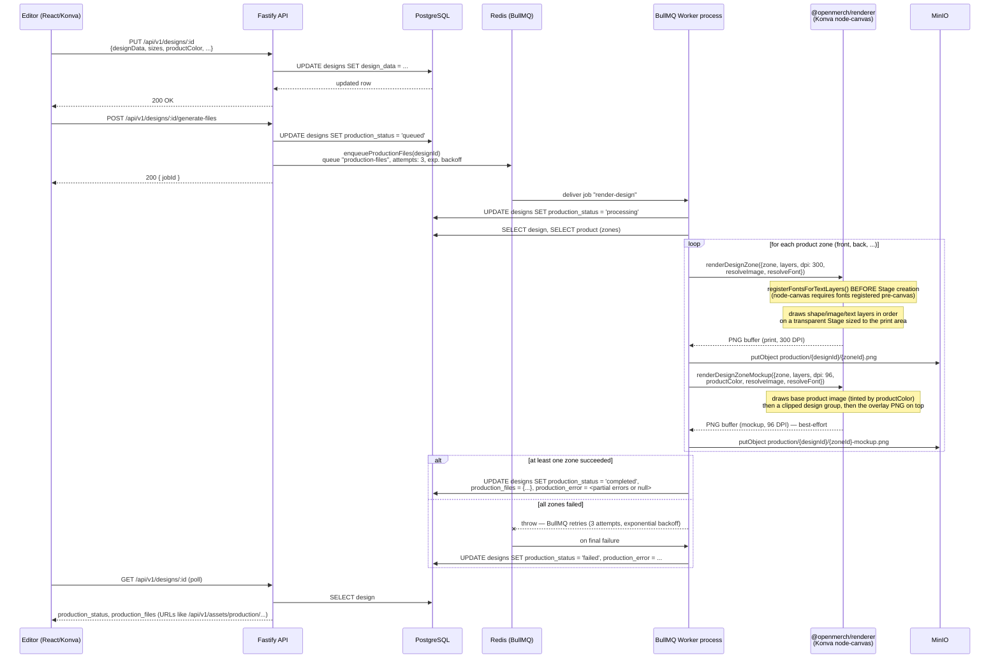
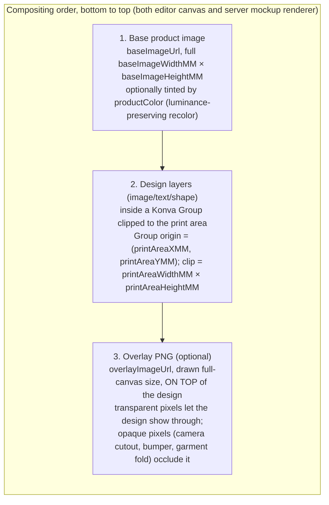

# Architecture

This document describes the actual, current architecture of OpenMerch Engine as implemented in this repository. It is generated from the source code (`packages/api`, `packages/renderer`, `packages/editor`, `apps/admin`), not from design intent — where the code doesn't answer a question, that is stated explicitly instead of guessed.

## 1. What is OpenMerch Engine

OpenMerch Engine is a self-hosted, open-source product customization platform for ecommerce: a "design your own merch" editor plus the backend needed to turn a customer's design into a print-ready file. A shopper (or a merchant, via the admin panel) picks a product — t-shirt, mug, phone case, poster, pillow, etc. — and places images, text and shapes onto one or more print zones using a browser-based canvas editor. The design is saved as structured JSON (layers, positions in millimeters, fonts, effects), not as a flat image, so it stays editable and resolution-independent.

Turning a saved design into deliverable files is an asynchronous job: the API enqueues a BullMQ job, a separate worker process renders the design at print resolution (300 DPI) using server-side Konva (`node-canvas`) plus a lower-resolution merchant-facing mockup (96 DPI) with the product photo composited underneath and any product overlay (camera cutout, bumper edges, etc.) composited on top. Output files land in MinIO (S3-compatible object storage) and the design row in Postgres is updated with their URLs.

The system is a pnpm/Turborepo monorepo split into four kinds of packages: `@openmerch/core` (shared TypeScript types, unit conversion), `@openmerch/renderer` (server-side rendering, Node-only), `@openmerch/editor` (the React/Konva canvas component, embeddable in any host app), and two apps — `apps/demo` (a minimal integration example) and `apps/admin` (the merchant-facing back office for managing products, designs, orders, cliparts, fonts, templates, and settings). `packages/api` is the Fastify HTTP API and the BullMQ worker entrypoint, sharing one Postgres schema (Drizzle ORM) and one MinIO bucket. `packages/embroidery` and `plugins/plugin-woocommerce` exist as empty placeholder directories (`.gitkeep` only) — not implemented.

## 2. System architecture



Notes on what the code actually does, not what a typical setup might imply:

- The API server and the worker are **two separate Node processes** started independently (`pnpm --filter @openmerch/api dev` / `pnpm --filter @openmerch/api worker`, or `node dist/index.js` / `node dist/worker.js` in Docker). They share the same Postgres schema, the same MinIO bucket, and the same BullMQ queue name (`production-files`) over Redis, but do not call each other directly — `packages/api/src/worker.ts` is a standalone entrypoint, not a subprocess of the HTTP server.
- The editor package is not a standalone app — `apps/demo` is the example host that renders `<ProductEditor product={...} />`. There is no separate "editor server"; the editor talks to the same Fastify API as everything else via `packages/editor/src/services/api.ts`.
- Sharp is a dependency of `packages/api`, but it is only used inside `ImageResolver.rasterizeSvg()` (`packages/api/src/jobs/resolvers/image-resolver.ts`) to rasterize SVG clipart/shape layers to PNG before handing them to Konva. The actual 300 DPI / 96 DPI PNG generation is done by Konva's Node build (`konva/lib/index-node.js`), which is backed by `node-canvas` (Cairo/Pango), not by Sharp.
- `docker-compose.yml` starts Postgres/Redis/MinIO by default; the `api` and `worker` services are opt-in via the `app` and `worker` Compose profiles — the documented dev workflow is native `pnpm dev` / `pnpm worker` against dockerized infra.
- There is no authentication/authorization layer visible in `packages/api/src` — routes are unauthenticated REST endpoints. CORS is configured via `CORS_ORIGIN` (defaults to `*`).

## 3. Database schema (PostgreSQL, Drizzle ORM)

Source: `packages/api/src/db/schema.ts`, migrations in `packages/api/drizzle/` (3 migrations at the time of writing: `0000_bitter_rocket_racer`, `0001_wandering_sue_storm`, `0002_graceful_iceman`). All tables use `uuid` primary keys with `defaultRandom()` except `settings` (string primary key) and `translations`/`languages` (uuid).



Points that are easy to get wrong by guessing instead of reading the code:

- **`production_jobs` is defined in the schema and has its own migration, but no route or worker code reads or writes it** (`Grep` for `productionJobs` only matches `schema.ts`). Production status/output URLs are actually tracked directly on `designs.productionStatus`, `designs.productionFiles` (a `{ [zoneId]: { print, mockup } }` JSON map) and `designs.productionError`. Treat `production_jobs` as vestigial/unused unless a future change starts using it.
- **`translations.languageCode` has no foreign-key constraint** to `languages.code` in the schema — the relationship is enforced only at the application level in `routes/languages.ts`.
- `products`, `templates`, `cliparts`, `fonts`, `shapes`, `printing_types` are independent catalog tables; none of them reference each other or `designs` at the DB level. A design references its product via `designs.product_id`, but which cliparts/fonts/shapes were used in a design is not tracked relationally — that information only exists inside `designs.design_data` (the layer JSON), e.g. `TextLayer.fontId`.
- Standalone tables not shown with relationships because they have none: `assets` (generic upload registry, keyed by MinIO `storage_key`), `settings` (flat key/value store for admin-configurable settings such as branding and API keys, with an `is_secret` flag).

## 4. Production pipeline (design save → print + mockup PNGs)



Key implementation details worth calling out because they are not obvious from a generic "job queue" description:

- **Two renders per zone, independent failure modes.** `renderDesignZone` (print, 300 DPI, transparent background) is the contractual output — if it fails, the whole zone is marked failed. `renderDesignZoneMockup` (96 DPI, product photo + design + overlay) is best-effort: a mockup failure is logged but does not fail the zone, since the print file is still usable without it.
- **Partial success is a valid terminal state.** If zone "front" renders but "back" throws, the design still ends up `production_status: 'completed'`, with `production_files` containing only "front" and `production_error` holding a semicolon-joined list of per-zone errors. Only a **complete** failure across all zones throws (triggering BullMQ's retry/backoff) and eventually sets `production_status: 'failed'`.
- **Variant-aware zone resolution.** If a design's stored `canvasWidthMM`/`canvasHeightMM` doesn't match the product's default zone dimensions (design made against a size/device variant), the worker searches `product.variants[].zones` for a matching zone and swaps in its dimensions/images before rendering.
- **Image resolution is abstracted behind `ImageResolver`** (`packages/api/src/jobs/resolvers/image-resolver.ts`), which handles four `src` shapes: `data:` URLs, `/api/v1/assets/...` (MinIO), `http(s)://...` (external, e.g. AI-generated or stock images), and `/products/...` (repo-shipped mockup images, read from disk directly in dev or via HTTP fallback in Docker). SVG buffers are auto-detected and rasterized through Sharp before being handed to Konva.
- **Fonts must be registered before the Konva Stage is created**, not lazily — this is a `node-canvas` constraint, so both render functions call `registerFontsForTextLayers()` up front via `FontResolver` (`packages/api/src/jobs/resolvers/font-resolver.ts`), resolving either by `fontFamily` name or by `fontId` (UUID) when the design used a merchant-uploaded custom font.
- Output URLs are internal API paths (`/api/v1/assets/production/{designId}/{zoneId}.png`), served back through `GET /api/v1/assets/*` in `routes/assets.ts`, which streams the object out of MinIO — clients never talk to MinIO directly.

## 5. Print zones and overlays (mask system)

There is no dedicated "mask" abstraction in the code — the effect is achieved with three cooperating primitives, all driven by `ProductZone` (`packages/core/src/types/product.ts`):

```ts
interface ProductZone {
  id: string;
  name: string;
  baseImageWidthMM: number;
  baseImageHeightMM: number;
  printAreaWidthMM: number;
  printAreaHeightMM: number;
  printAreaXMM: number;
  printAreaYMM: number;
  baseImageUrl: string;
  overlayImageUrl?: string; // optional, on top of design layers
}
```



What each piece does, per the actual code:

1. **Print-area clip (the "mask").** Both `ProductEditor.tsx` (editor, live canvas) and `render-zone-mockup.ts` (server mockup) wrap design layers in a Konva `Group` positioned at `(printAreaXMM, printAreaYMM) * pxPerMM` with `clipX/clipY = 0` and `clipWidth/clipHeight = printAreaWidthMM/HeightMM * pxPerMM`. This is a hard rectangular clip — there is no arbitrary-shape/vector mask in the codebase, only axis-aligned rectangle clipping via Konva's clip properties. `renderDesignZone` (the pure print file, no product photo) does not need this clip because its canvas *is* the print area (`widthPx = printAreaWidthMM @ dpi`), so it draws layers directly without an offsetting group.
2. **Product overlay image.** `overlayImageUrl` is optional per zone. When present, it's drawn as a full-canvas image **after** the design layers, in both the editor's live `CanvasView` and the server's `renderDesignZoneMockup`. It is not used by `renderDesignZone` (the bare print file) — the print output never needs the product photo's decorative edges, only the design artwork. Concretely this is how a phone case's camera-cutout ring or a mug handle can visually sit "in front of" the customer's design without the print file itself containing that artwork.
3. **Product color tint.** `useColoredProduct` (editor hook, `packages/editor/src/hooks/useColoredProduct.ts`) and `tintImage()` (server, inline in `render-zone-mockup.ts`) implement the *same* luminance-preserving recolor algorithm independently — sample the four corners to detect a dark vs. light background, detect alpha transparency, then remap each visible pixel's luminance onto the target hex color while skipping background pixels (near-white on light backgrounds, near-black on dark backgrounds). This keeps the admin-rendered mockup visually consistent with what the customer saw in the editor when they picked a garment color. It is a duplicated implementation, not a shared function from `@openmerch/renderer` or `@openmerch/core` — if the algorithm changes, both copies need to be updated.
4. **Variant-specific zones.** A `ProductVariant` can carry its own `zones: ProductZone[]`, fully replacing the product's default zones (different `baseImageUrl`, different print area). `ZoneSelector.tsx` in the editor only switches between a product's *top-level* zones (e.g. front/back) by `activeZoneId`; variant selection and its effect on zone geometry is handled elsewhere in the editor store / `ProductTab.tsx` (not traced in detail here — flagging that the variant-to-zone-swap UI path was not fully verified against this document, only its consumption by the worker in section 4).

## 6. Monorepo structure

Verified with `Glob`/`find` against the working tree (excluding `node_modules`, `dist`, `.turbo`, `.git`, `.claude`, and the large binary asset folders `products/`, `overlays-products-base/`, `apps/demo/public/products/`):

```
openmerch-engine/
├── apps/
│   ├── admin/                        # Merchant back office — React 19 + Mantine 9, port 3002
│   │   └── src/
│   │       ├── components/           # Layout, LinksGroup, ZoneEditor
│   │       ├── hooks/                # useConfirm
│   │       ├── i18n/
│   │       ├── pages/                # Dashboard, Products, ProductEdit, Designs, Templates,
│   │       │                         # Cliparts, Shapes, Fonts, PrintingTypes, Orders,
│   │       │                         # Languages, SettingsPage, ComingSoon
│   │       └── services/api.ts
│   └── demo/                         # Minimal integration example — React 19, port 3000
│       └── src/
│           ├── App.tsx
│           ├── products/tshirt.ts    # example ProductZone config
│           └── main.tsx
├── docs/
│   ├── PROJECT_CONTEXT.md
│   ├── ROADMAP.md
│   └── ARCHITECTURE.md               # this file
├── packages/
│   ├── core/                         # Shared types + unit conversion (mmToPx etc.), no deps
│   │   └── src/{types,utils}/
│   ├── renderer/                     # Server-side rendering (Node-only, Konva node-canvas)
│   │   └── src/
│   │       ├── layers/               # image.ts, shape.ts, text.ts, text-effects.ts
│   │       ├── konva-node.ts         # dynamic import of konva/lib/index-node.js
│   │       ├── render-zone.ts        # print PNG, 300 DPI
│   │       └── render-zone-mockup.ts # mockup PNG, 96 DPI, base+overlay compositing
│   ├── editor/                       # Embeddable React/Konva canvas editor
│   │   └── src/
│   │       ├── components/           # ProductEditor (root), DesignLayer, ZoneSelector,
│   │       │   ├── contextual/       #   NavBar, Toolbar, SnapGuides, StageNavigator...
│   │       │   └── sidebar/tabs/     # per-tool popovers (Fill, Filters, TextEffects...)
│   │       │                         # sidebar tabs: Cliparts, Image, Shapes, AiImage,
│   │       │                         # Backgrounds, Photos, Layers, Text, Product
│   │       ├── hooks/                # useImage, useTintedImage, useColoredProduct,
│   │       │                         # useKeyboardShortcuts
│   │       ├── store/editorStore.ts  # Zustand store
│   │       ├── services/api.ts
│   │       └── utils/                # exportDesign, textPaths
│   ├── api/                          # Fastify HTTP API + BullMQ worker entrypoint
│   │   └── src/
│   │       ├── routes/               # 12 modules: health, products, designs, assets,
│   │       │                         # templates, cliparts, shapes, fonts,
│   │       │                         # printing-types, orders, languages, settings
│   │       ├── jobs/
│   │       │   ├── queues.ts         # BullMQ Queue definition ("production-files")
│   │       │   ├── connection.ts     # Redis connection (parsed from REDIS_URL)
│   │       │   ├── resolvers/        # ImageResolver, FontResolver
│   │       │   └── workers/production-files.worker.ts
│   │       ├── db/                   # schema.ts (Drizzle), index.ts (client)
│   │       ├── storage/minio.ts
│   │       ├── index.ts              # HTTP server entrypoint
│   │       ├── worker.ts             # Worker process entrypoint (separate from index.ts)
│   │       └── seed.ts
│   │   ├── drizzle/                  # SQL migrations + snapshots (3 migrations)
│   │   └── seeds/                    # products/catalog.json, translations/{es,fr}.json
│   ├── embroidery/                   # placeholder — .gitkeep only, not implemented
│   └── (workspace root also defines packages/core, editor, renderer, api above)
├── plugins/
│   └── plugin-woocommerce/           # placeholder — .gitkeep only, not implemented
├── products/                         # Product mockup base images + overlays (served statically)
├── overlays-products-base/           # Source .psd files for overlays (design assets, not code)
├── docker-compose.yml                # postgres, redis, minio (default) + api, worker (profiles)
├── turbo.json / pnpm-workspace.yaml
└── package.json                      # workspace root, pnpm@9.15.4, Node >=20
```

## 7. Technology stack (versions from `package.json`, as committed)

| Layer | Technology | Version |
|---|---|---|
| Monorepo tooling | pnpm workspaces + Turborepo | pnpm `9.15.4`, turbo `^2.4.4` |
| Language | TypeScript | `^5.7.3` (all packages) |
| Runtime | Node.js | `>=20.0.0` (engines), Docker base `node:20-bookworm-slim` |
| API server | Fastify | `^5.8.4` |
| API plugins | `@fastify/cors` `^11.2.0`, `@fastify/multipart` `^9.4.0`, `@fastify/static` `^9.0.0` | |
| ORM | Drizzle ORM + `drizzle-kit` | `^0.45.2` / `^0.31.10` |
| Postgres driver | `postgres` (postgres-js) | `^3.4.8` |
| Database | PostgreSQL | `16-alpine` (docker-compose) |
| Queue | BullMQ | `^5.71.1` |
| Queue backend | Redis | `7-alpine` (docker-compose) |
| Object storage | MinIO (server) + `minio` JS client | server `minio/minio:latest`, client `^8.0.7` |
| Image processing | Sharp (SVG rasterization only) | `^0.34.2` |
| Server-side canvas | `canvas` (node-canvas, Cairo/Pango backend) | `^3.1.0` |
| Rendering engine | Konva (Node build, `index-node.js`) | `^9.3.16` (renderer) / `^9.3.18` (editor, admin) |
| Editor UI | React + ReactDOM | `^19.0.0` |
| Editor canvas bindings | `react-konva` | `^19.0.3` |
| Editor state | Zustand | `^5.0.3` |
| Editor icons | `lucide-react` | `^0.577.0` |
| Editor build | Vite + `vite-plugin-dts` | `^6.1.0` / `^4.5.0` |
| Admin UI framework | Mantine (`core`, `dropzone`, `form`, `hooks`, `modals`, `notifications`) | `^9.0.0` |
| Admin routing | `react-router-dom` | `^7.6.1` |
| Dev runtime (API) | `tsx` (watch mode) | `^4.21.0` |
| Linting | ESLint + `typescript-eslint` | `^9.18.0` / `^8.21.0` |
| Formatting | Prettier | `^3.4.2` |
| Testing | Vitest | `^3.0.4` (used at least in `packages/core`) |
| License | MIT | — |

Ports used in local dev (from Vite configs and `config.ts` defaults): API `3001`, demo app `3000`, admin app `3002`; infra defaults Postgres `5432`, Redis `6379`, MinIO `9000` (API) / `9001` (console).
